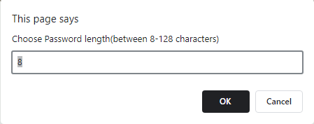
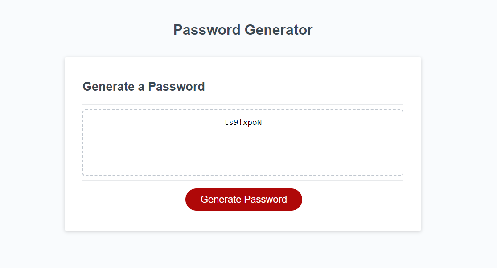

# PasswordGenerator

## Description

The aim of this project was to make an application that would allow an employee to generate a random password using selected criteria. This was done by building on the given starter code, adding functions to make prompts that can be called repeatedly if needed, to generate a random value repeatedly and to reload the page if criteria are met. I also used various types of methods to manipulate and iterate on the data. I got a lot of practice and gained a much more in depth understanding of these topics in this project. 

## Installation

Application deploys at live URL
Link: https://kaiwright.github.io/PasswordGenerator/

## Usage

The website deploys from the link above. The page loads into a series of prompts that ask the user to answer yes or no to different options. By pressing the button, the user can generate a password. If the button is clicked again, the page reloads so that new options can be selected and another password can be generated. The default options are displayed in the prompts, but can be easily overwritten by typing a different input. 

## License

MIT License

## Credits
I completed this work on my own, with the use of the resources listed below. 
### Resources
* Cancel terminating: https://stackoverflow.com/questions/12864582/javascript-prompt-cancel-button-to-terminate-the-function 
* Confirming: https://www.w3schools.com/jsref/met_win_confirm.asp#:~:text=The%20confirm()%20method%20displays,%22OK%22%2C%20otherwise%20false%20.
* Convert to lowercase: https://w3schools.com/jsref/jsref_tolowercase.asp#:~:text=The%20toLowerCase()%20method%20converts,not%20change%20the%20original%20string.
* Join method: https://herewecode.io/blog/array-to-string-without-commas-javascript/#:~:text=In%20JavaScript%2C%20all%20arrays%20have,all%20the%20array%20elements%20concatenated.
* Refresh the page method: https://www.freecodecamp.org/news/javascript-refresh-page-how-to-reload-a-page-in-js/#:~:text=The%20simplest%20way%20to%20refresh,and%20loading%20the%20latest%20content.

